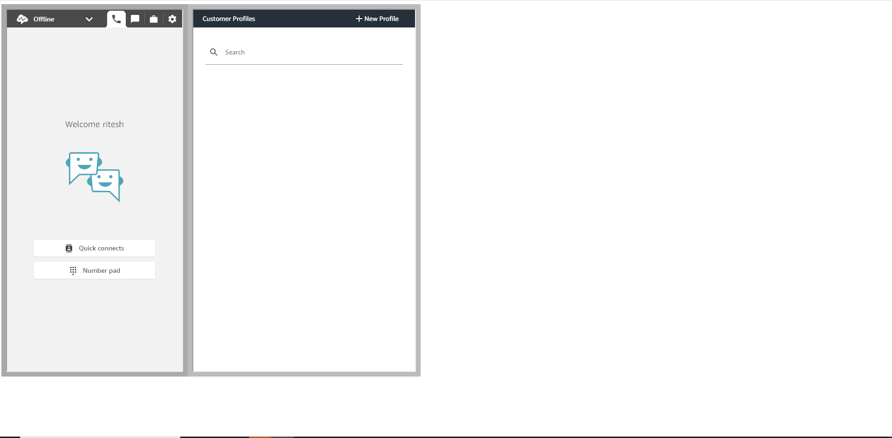

# aws-connect-custom-ccp

This repository is starting point for connect agent ccp with customer profiles (profile setup if already done) 

## Changes for instance id

1) Clone the repo 
2) Change the alias for connect instance 
	GO to connect.html and replace connectAliasId with Instance Alias Id 

